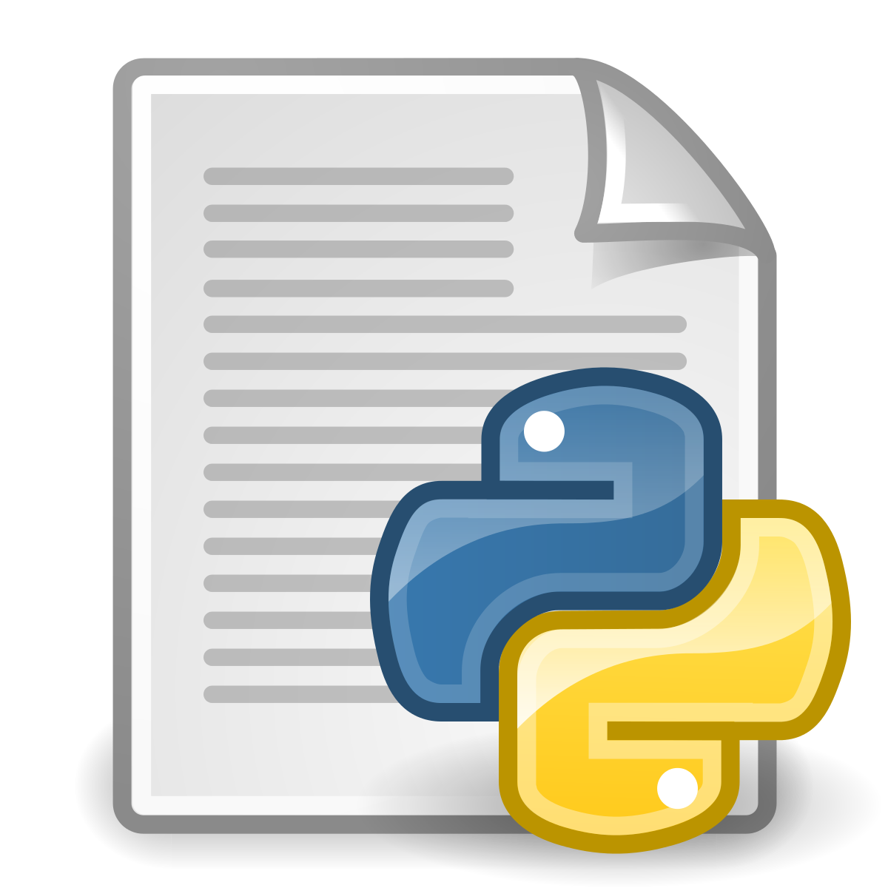

# Hi everyone!✌🏽

My name is Giovanni Cerqueira. I'm from Brazil. I'm a software/web development student 💻.

I'm passionate about solving problems and learning. Always open to new challenges and ready to face changes! 🚀

📍 São Paulo - SP.
###

  
  
  

<h3>BACK-END</h3>
  

  
  
  
  
  
  
  
  
   
  

---

  <h3>FRONT-END</h3>
  

   
   
   
   
   
   
    
  

---

  <h3>IDEs</h3>
  

    
    
    
  

---

  <h3>OTHERS</h3>
  

  
  
  
  
   
    
  

 

**You can connect with me by clicking here:**    

  
  

